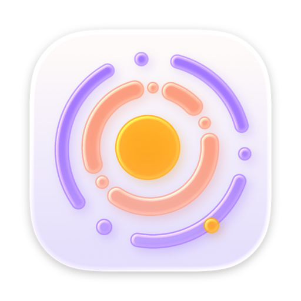
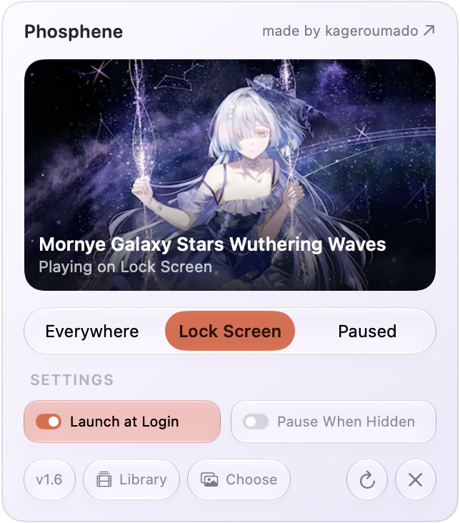
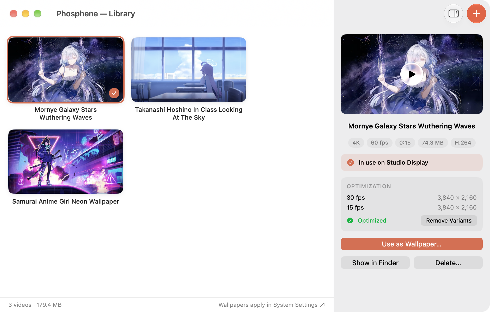

<div align="center">



# Phosphene

**any video, as your real macOS wallpaper ・ on the desktop and the lock screen ♡**

[](https://kagerou.glass/phosphene/)
[](https://x.com/kageroumado)
[](#requirements)

<table>
  <tr>
    <td align="center" width="40%"><picture><source media="(prefers-color-scheme: dark)" srcset=".github/phosphene-popover-dark.png"></picture><br><sub><b>the menu bar</b> ・ preview, pause, switch displays</sub></td>
    <td align="center" width="60%"><br><sub><b>your library</b> ・ import, inspect, and optimize your videos</sub></td>
  </tr>
</table>

</div>

macOS doesn't let you use your own videos as wallpaper. The desktop only takes stills, and the lock screen only plays Apple's approved Aerials. Phosphene removes that limit: it's a menu bar app + wallpaper extension that adds **any video you like** to **System Settings → Wallpaper** — as its own collection, selectable for the desktop and the lock screen exactly like a built-in.

There's no floating window pretending to be a wallpaper. Phosphene plugs into Apple's private `WallpaperExtensionKit` framework — the same wallpaper pipeline Apple's own Aerials use — which means playback runs out-of-process, survives app quits, works on the real lock screen, and integrates with the OS-level lock / idle / sleep lifecycle.

> ⚠️ **Private framework.** Phosphene loads `WallpaperExtensionKit` via `dlopen` and uses Mirror-based runtime introspection to talk to its XPC types. Apple could change this at any major OS release. Validated on macOS 26 (Tahoe) and macOS 27 (beta).

## Features

- **Bring your own videos.** Import MP4 / MOV / any AVFoundation-readable file. They show up in the system wallpaper picker.
- **Gapless looping.** Frame-accurate loops by offsetting PTS/DTS across loop boundaries — no flush, no stutter.
- **Multi-display + per-Space selections.** Different wallpapers per display, persisted by macOS.
- **Power-aware playback.** A graduated `PlaybackPolicy` reduces work or pauses entirely based on thermal state, battery level, on-battery vs AC, Game Mode, and presentation mode (active / locked / idle).
- **Smooth lock-screen ramp.** When *Only on Lock Screen* is enabled, the wallpaper eases in/out with a cubic curve as you lock and unlock, matching Apple's own Aerials behavior.
- **Pause when occluded.** Detects when every display is fully covered by windows and pauses rendering until the desktop is visible again.
- **Adaptive variants.** Optionally pre-render lower-resolution / lower-fps variants of a video; the renderer swaps to the cheapest variant that satisfies the current policy at each loop boundary.
- **Menu bar control.** Preview the current wallpaper, toggle pause, switch displays, configure behavior, launch at login.

## Requirements

- **macOS Tahoe (26.0+).** Phosphene depends on the Wallpaper extension point introduced in macOS 14 but uses Tahoe-only SwiftUI and `glassEffect()` APIs. Tested on macOS 26 and macOS 27 (beta).
- **Apple Silicon or Intel.** Releases ship as a universal binary (`arm64` + `x86_64`).
- **Xcode 17+** to build, with Swift 6 strict concurrency enabled.

## Install

Grab the signed, notarized DMG from **[GitHub Releases](https://github.com/kageroumado/phosphene/releases/latest)** — open it, drag **Phosphene** to Applications, and launch.

Or via Homebrew — Phosphene is in the official [homebrew/cask](https://formulae.brew.sh/cask/phosphene) repository:

```sh
brew install --cask phosphene
```

(It also remains available from [my tap](https://github.com/kageroumado/homebrew-tap) as `kageroumado/tap/phosphene`.)

## Building

```sh
git clone https://github.com/kageroumado/phosphene.git
cd phosphene
open Phosphene.xcodeproj
```

In Xcode, select the **Phosphene** scheme and Run. The project uses synchronized filesystem groups, so adding/removing files in `Phosphene/` or `PhospheneExtension/` requires no pbxproj edits.

You'll need to set a development team for code signing. The wallpaper extension is embedded into the app bundle and registered with the system when the app launches.

For a headless compile check without local signing identities:

```sh
xcodebuild -project Phosphene.xcodeproj -scheme Phosphene -configuration Debug \
  -destination 'generic/platform=macOS' \
  CODE_SIGNING_ALLOWED=NO CODE_SIGNING_REQUIRED=NO CODE_SIGN_IDENTITY='' build
```

On the default DerivedData path, the unsigned debug app is produced at:

```text
~/Library/Developer/Xcode/DerivedData/Phosphene-*/Build/Products/Debug/Phosphene.app
```

To install that local debug build into Applications:

```sh
rm -rf /Applications/Phosphene.app
cp -R ~/Library/Developer/Xcode/DerivedData/Phosphene-*/Build/Products/Debug/Phosphene.app /Applications/
```

### Using a video wallpaper

1. Launch Phosphene. Use the menu bar icon to **Manage Library** and add one or more videos.
2. Open **System Settings → Wallpaper**. Phosphene's videos appear under their own collection.
3. Pick a video. macOS handles the actual wallpaper assignment — Phosphene's extension provides the frames.

## Architecture

```
┌─────────────────────────┐         ┌──────────────────────────────┐
│  Phosphene.app          │         │  PhospheneExtension.appex     │
│  (menu bar UI)          │         │  (host: WallpaperAgent)       │
│                         │         │                              │
│  • Library management   │  Darwin │  • XPC handler                │
│  • Per-video metadata   │ ──────▶ │  • AVSampleBufferDisplayLayer │
│  • Optimization (HEVC)  │  notif. │  • Power / thermal monitor    │
│  • Preferences          │         │  • Snapshot generator         │
└─────────────────────────┘         └──────────────────────────────┘
                  │                              │
                  └──────────────┬───────────────┘
                                 ▼
                  Extension sandbox container
                  (~/Library/Containers/glass.kagerou.phosphene.extension
                       /Data/Documents)
                  • Video library + variants
                  • WallpaperPrefs.plist
                  • BMP snapshot cache
```

> **Storage model.** The extension is sandboxed; the menu-bar app is not. The
> app writes the shared library directly into the extension's sandbox container
> (the path above) and signals changes via a Darwin notification. This is a
> deliberate, documented contract rather than an App Group container — the app's
> only job is to populate the directory the extension reads from.

**App side** (`Phosphene/`) — SwiftUI menu-bar app. Manages the on-disk video library, transcodes optional lower-resolution variants via `VideoOptimizationService`, exposes preferences, and posts a Darwin notification when the library changes.

**Extension side** (`PhospheneExtension/`) — runs inside the system `WallpaperAgent` process when a Phosphene wallpaper is active. Loads `WallpaperExtensionKit.framework` at runtime, registers as a wallpaper provider, and renders frames into a remote `CAContext` via `AVSampleBufferDisplayLayer`. It receives XPC `acquire` / `update` / `invalidate` / `snapshot` calls from `WallpaperAgent` and routes presentation-mode changes through `PlaybackPolicy`.

**`PlaybackPolicy`** is the single source of truth for playback behavior. Inputs (thermal state, battery, presentation mode, user pause, occlusion, etc.) collapse to one of `full / reduced / minimal / paused`. The renderer applies the policy on every state change.

**`VideoRenderer`** owns the decode pipeline. Instead of `AVPlayerLayer` — which silently fails inside a remote `CAContext` — it drives `AVSampleBufferDisplayLayer` manually: one `AVAssetReader` for the current loop, a preloaded one for the next, and a PTS offset that grows across loops to keep the timeline monotonically increasing. Result is glitch-free looping without flushing the renderer.

## Quirks worth knowing

- **`WallpaperSnapshotXPC` swizzle.** The system's snapshot encoder checks `type(of: coder) == NSXPCCoder.self`, but the real coder is a subclass. Without the runtime swizzle in `PhospheneExtension.swift`, snapshots silently encode to nothing and you get a grey lock screen during transitions.
- **Mirror-based XPC parsing.** Apple's request types (`WallpaperCreationRequestXPC` etc.) aren't part of any public SDK header. The extension reads them via `Mirror` reflection. If Apple renames fields, expect surgical breakage.
- **Variants are advisory.** A "1080p@30" variant won't be selected if Power-Monitor thinks we're on AC and idle — `PlaybackPolicy` always picks the highest tier that's still allowed.

## Troubleshooting

The extension writes a rotating log (1 MB × 3) to:

```
~/Library/Containers/glass.kagerou.phosphene.extension/Data/Documents/extension.log
```

By default it records only the meaningful events — wallpaper switches, presentation/state
changes, teardowns, spiral-of-death recovery, and errors. The high-volume internals
(per-frame feed ticks, renderer restart steps, per-connection XPC churn, snapshots) are
gated behind **verbose logging**.

### Enable verbose logging

Create a marker file in the extension's container, then restart the wallpaper agent so the
extension relaunches and picks it up:

```sh
touch ~/Library/Containers/glass.kagerou.phosphene.extension/Data/Documents/VERBOSE_LOG
killall WallpaperAgent
```

Disable it again by removing the marker and restarting the agent:

```sh
trash ~/Library/Containers/glass.kagerou.phosphene.extension/Data/Documents/VERBOSE_LOG   # or rm
killall WallpaperAgent
```

Attach the (verbose) log to a bug report — see `.github/ISSUE_TEMPLATE`.

### Wallpaper stuck, grey, or showing the wrong video

Rapidly switching video wallpapers in System Settings can wedge the system `WallpaperAgent`
(an Apple-side state desync, not Phosphene's renderer). Phosphene detects this and auto-heals
by restarting the agent, but if a wallpaper is ever stuck, grey, or showing the wrong clip,
use the menu bar → **Restart Wallpaper Agent** to recover immediately (equivalent to
`killall WallpaperAgent`).

## License

[MIT](LICENSE). Do whatever you want, no warranty.

## Acknowledgements

Built by [@kageroumado](https://x.com/kageroumado). Phosphene was originally a commercial project; it's open-source now because the market for "video wallpaper apps on macOS" turned out to be more crowded than it looked.
